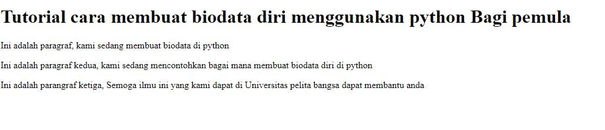
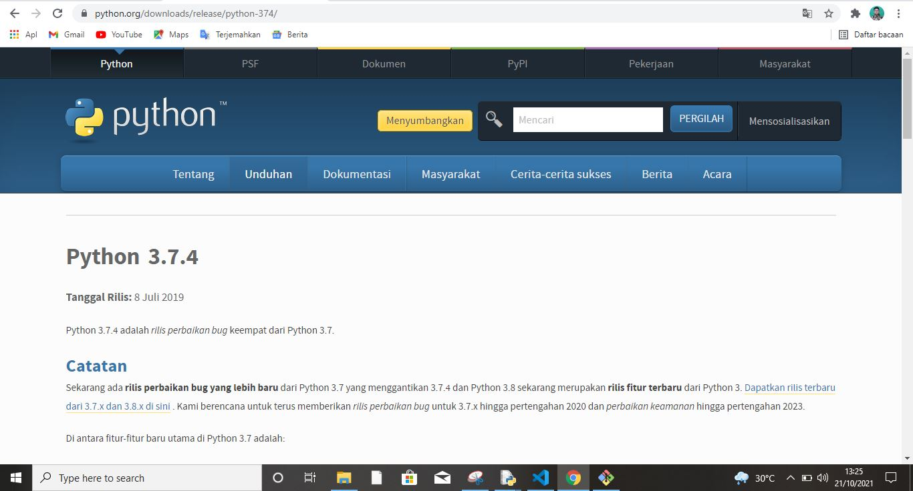
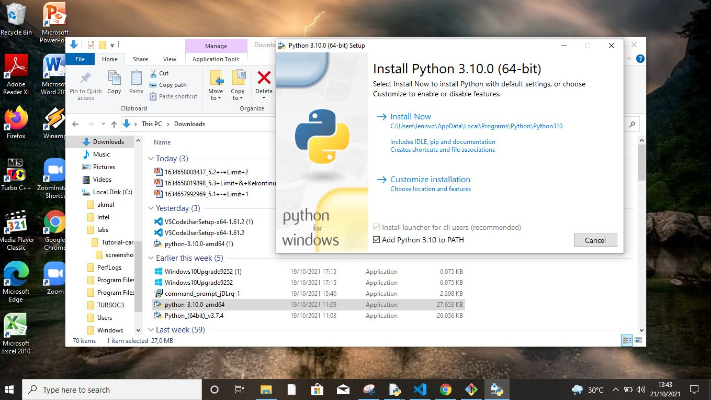
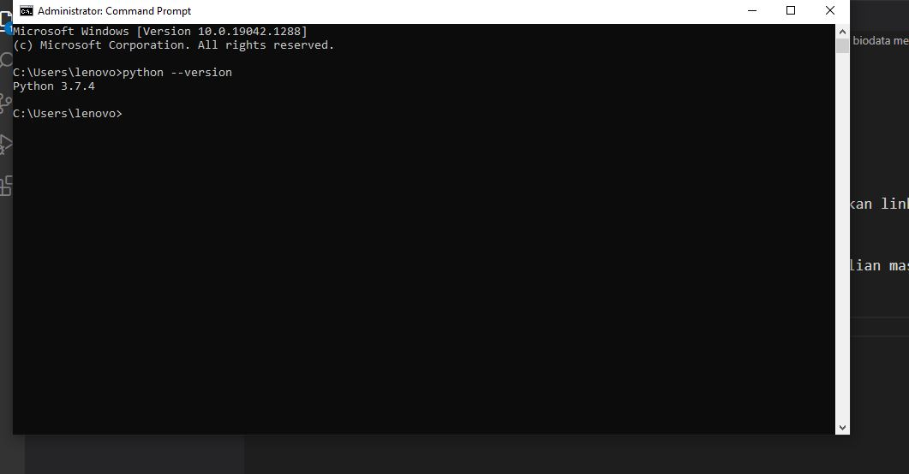
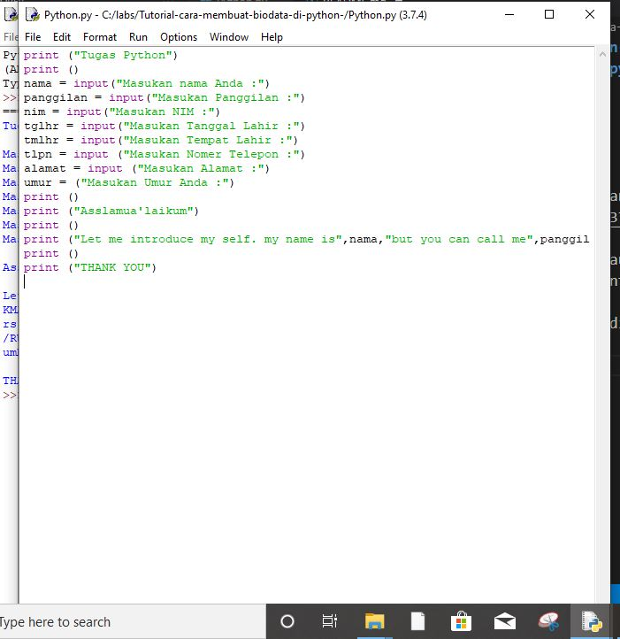
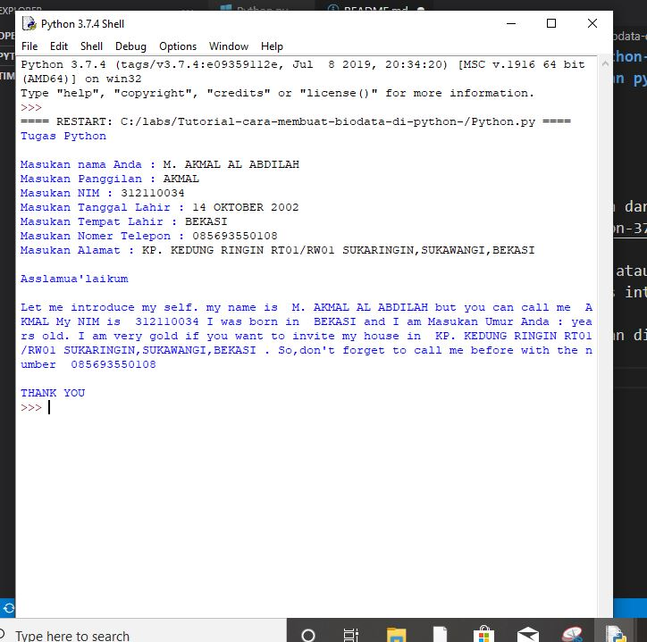

# Tutorial-cara-membuat-biodata-di-python-
## Tutorial membuat biodata menggunakan python

### Membuat paragraf
kode tag untuk paragraf adalah'
'
Ini adalah tampilannya

1. Mula-mula kalian mendownload Python dan kalian bisa menggunakan link ini https://www.python.org/downloads/release/python-374/

2. kalian instal pythom itu di laptop atau pc kalian caranya kalian masuk keberkas cari bacaan python klik dua kali terus intal

3. Kalian cek isntalannya python kalian di comman propt

4. Kalian bukan python yang terus pilih python yang idle, setelah kalian masuk kalian pencet new file terus kalian coding seperti contoh berikut:

